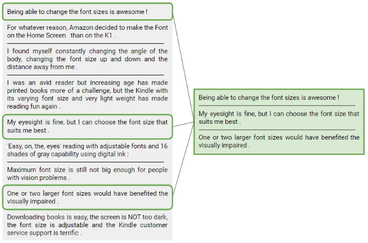

# Multi-Document Summarization
### With submodular functions and minheaps

Extractive summarization of multiple documents involves extracting a subset documents that summarizes the corpus. Contrary to abstractive summarization, which can generate new sentences, extract summarization feels less like A.I. and can be defined more easily as a discrete optimization problem.

In this project, I will attempt to summarize large corpora of customer product reviews using an objective function that rewards similarity of the chosen reviews to other reviews (coverage), while penalizing similarity within the chosen reviews (redundancy). This function happens to be [submodular](https://en.wikipedia.org/wiki/Submodular_set_function). While finding the exact solution is NP-hard, a greedy algorithm has been shown to work almost just as well. The submodularity property also allows us to use a maxheap to efficiently find the next best document to add to our existing set of documents until we hit our budget.

[Click here](https://github.com/TheShiya/synthetic-control-project/blob/master/synth_control.ipynb) to view the full notebook and [here](https://github.com/TheShiya/text-summarization/blob/master/summarizer.py) for the algorithm.

